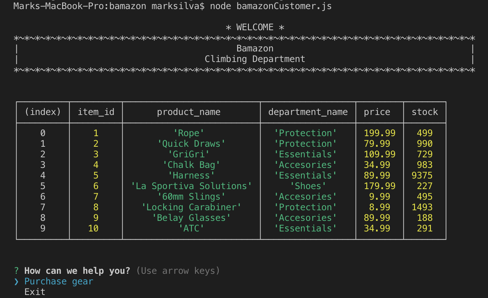
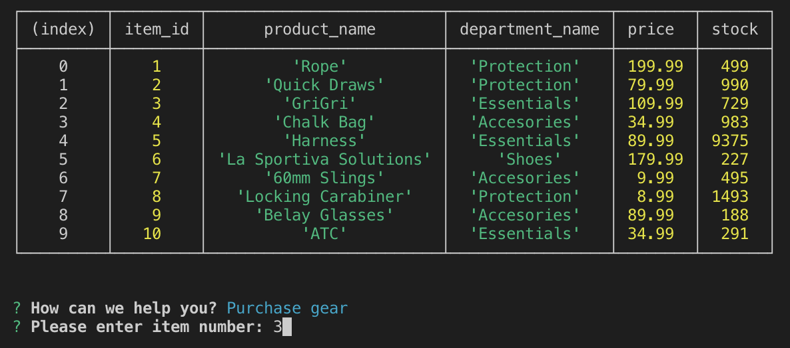
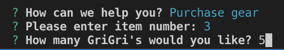
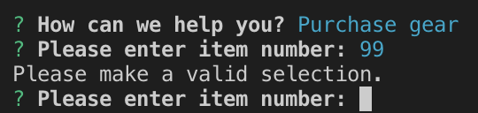
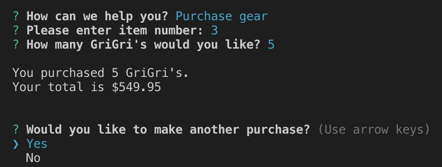
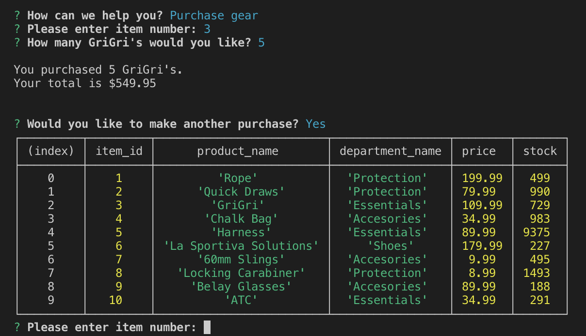
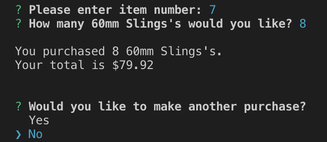
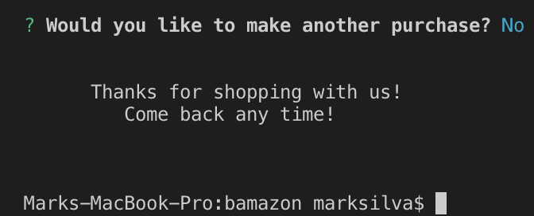

# bAmazon
## Virtual online storefront working with MySQL and Node.js to provide the ultimate shopping experience!

#### When the node command is entered, the user is presented with the available items in our store. This information is supplied through our MySQL database. The user is able to choose to begin shopping or exit the store.

#### If they choose *Purchase Gear*, the user begins shopping, they can choose which item they want by selecting the item_id

#### Once the item is selected, they are asked how many of that item they want to purchase

#### If the user selects an number item_id number that does not exsist, the are prompted to enter a vaild selection

#### Once they select the quantity, they are give their total and asked if they would like to continue shopping

#### Once the purchase is made, the quantity they purchased is deducted from the inventory

#### If they choose to continue shopping, they are directed by to the storefront and item_id prompt

#### If the user were to select not to continue shopping or to exit at the start screen,

#### They would exit the store

